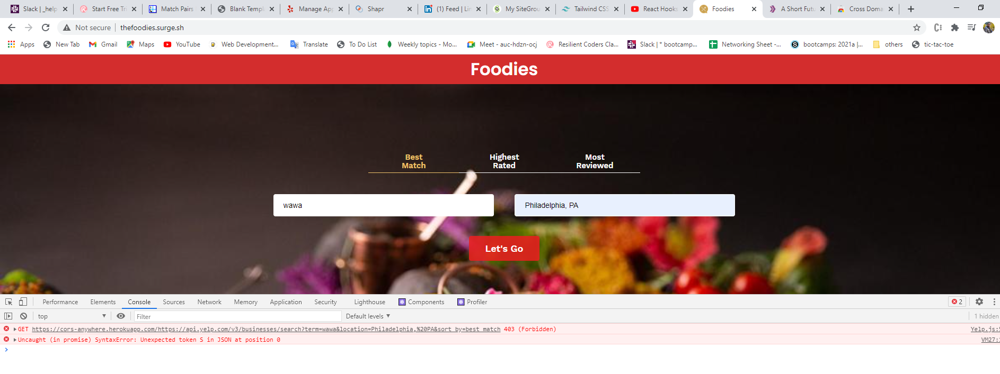

# thefoodies

### link to project
http://thefoodies.surge.sh/

## How it is made 
MERN Tech stack (MongoDB, Express, React, NodeJS)

## What it's about
Full stack app that leverages the yelp api to fetch data and renders it to the front end through the use of react components. App was made by passion and enthusiasm, I changed the app from using react redux to react hooks for better readability
